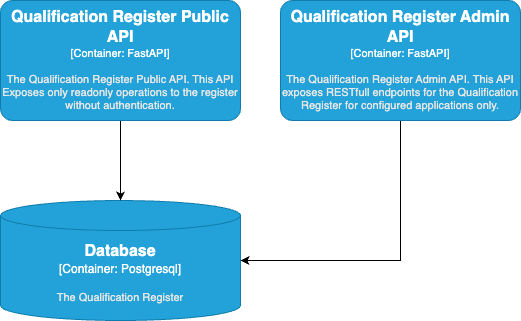
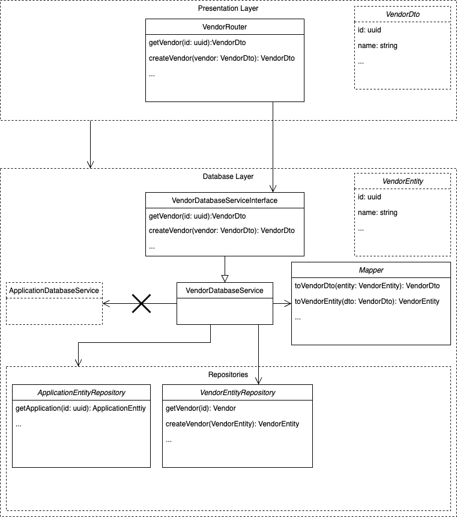

# Qualification Register Admin API

## Introduction

The qualification register makes it possible to make a selection of healthcare providers
who are qualified for specific information standards. This can be used as a step in the
localization process to make an initial selection of where information about a patient
for a specific care context, also called the exchange, can be found.

The qualification register is not part of GFModules main stack. Yet, it sits
in the background for further explorations at later stages.

## Design

The qualification register is split up in two main parts:

- The register
- The administration portal

The current setup only supplies an API for a future portal to be built.



## Disclaimer

This project and all associated code serve solely as **documentation and demonstration
purposes** to illustrate potential system communication patterns and architectures.

This codebase:

- Is NOT intended for production use
- Does NOT represent a final specification
- Should NOT be considered feature-complete or secure
- May contain errors, omissions, or oversimplified implementations
- Has NOT been tested or hardened for real-world scenarios

The code examples are *only* meant to help understand concepts and demonstrate possibilities.

By using or referencing this code, you acknowledge that you do so at your own risk
and that the authors assume no liability for any consequences of its use.

## First run

If you need to run the application without actual development, you can use the autopilot functionality. When this
repository is checked out, just run the following command:

```bash
make autopilot
```

This will configure the whole system for you and you should be able to use the API right away at <https://localhost:8506/docs>

## Usage

The application is a FastAPI application, so you can use the FastAPI documentation to see how to use the application.

## Development

Build and run the application

Firstly, copy the `app.conf.example` to `app.conf` and adjust values when needed.
If you run Linux, make sure you export your user ID and group ID to synchronize permissions with the Docker user.

export NEW_UID=$(id -u)
export NEW_GID=$(id -g)

The application uses a private [shared python library](https://github.com/minvws/gfmodules-python-shared). To be able to install this library inside docker using
poetry the auth.toml file needs to exist. Run to following shell script with your credentials to setup the auth.toml.
You can [generate a new access token(`repo`)](https://github.com/settings/tokens/new?scopes=repo&description=Repo+token) with the full **repo** scope or read more about
[managing your personal access tokens](https://docs.github.com/en/github/authenticating-to-github/creating-a-personal-access-token).

```
echo """[http-basic.git-minvws-gfmodules-python-shared]
username = "your-github-username"
password = "your-github-pat"""" > ~/.auth.toml
```

When you're ready, run the application with: `make autopilot`

## Application Architecture

This application is a straightforward CRUD API that enables authorized clients to
**C**reate, **R**ead, **U**pdate and **D**elete. <!-- codespell:ignore -->

Because this application doesn't have a business layer (Yet) the application is split up into 2 layers. See the image
below for an example entity split up into the 2 layers.


